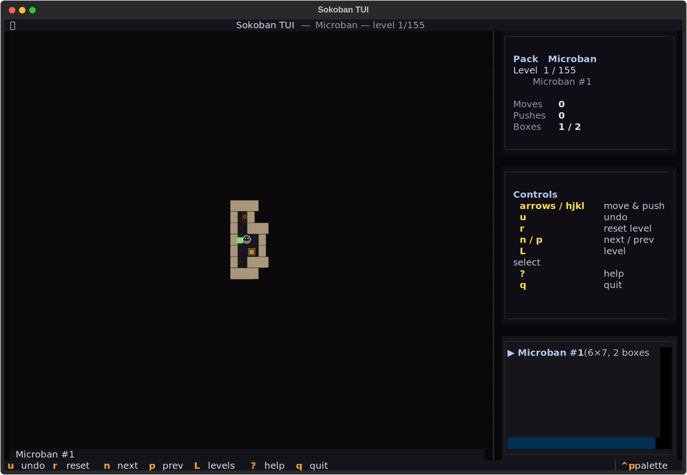
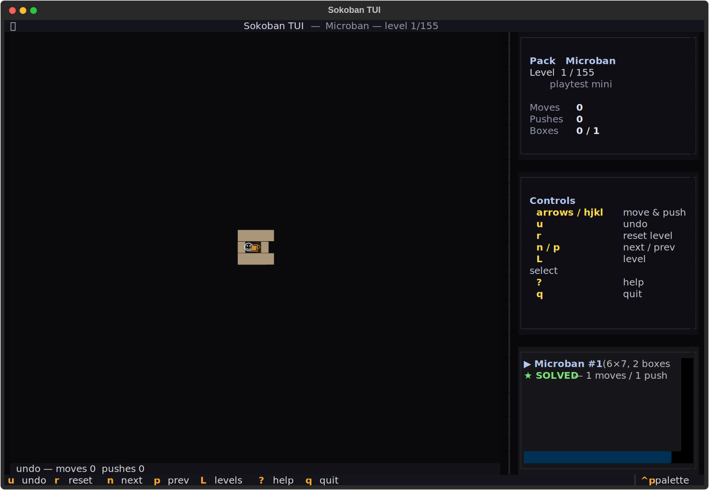
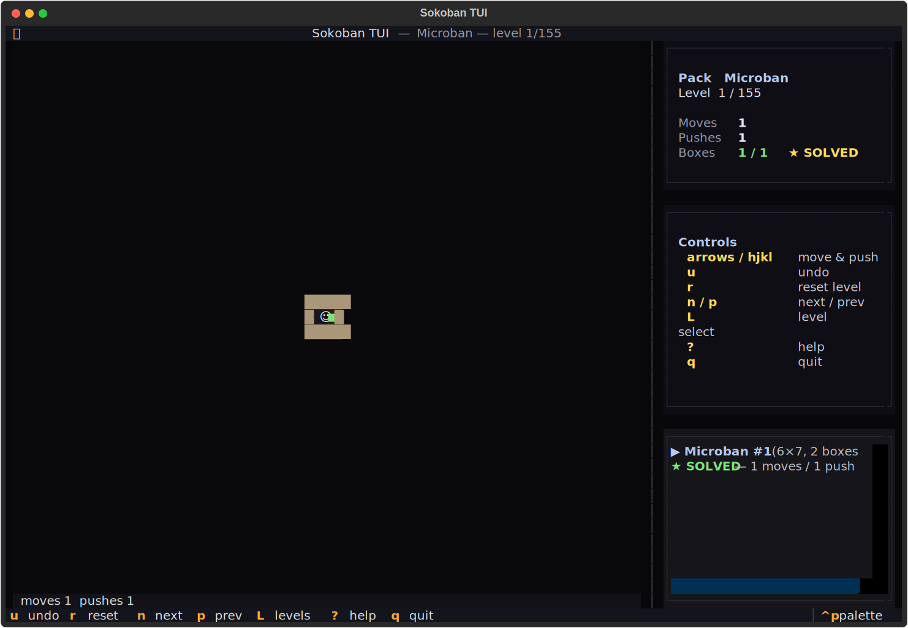

# sokoban-tui
Push. Plan. Pray.





## About
Push a crate. Push another crate. Push yourself into a corner and reset. 431 official levels across five packs — XSokoban Classic, Microban, Microban II, Sasquatch — bundled, all solvable. Unbounded undo. Level select. Move and push counters. The world's most stressful warehouse simulator, rendered in tidy unicode.

## Screenshots


## Install & Run
```bash
git clone https://github.com/akakabrian/sokoban-tui
cd sokoban-tui
make
make run
```

## Controls
<Add controls info from code or existing README>

## Testing
```bash
make test       # QA harness
make playtest   # scripted critical-path run
make perf       # performance baseline
```

## License
MIT

## Built with
- [Textual](https://textual.textualize.io/) — the TUI framework
- [tui-game-build](https://github.com/akakabrian/tui-foundry) — shared build process
